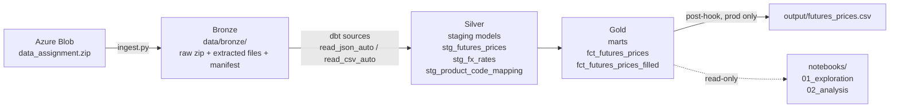

# Interfood Analytics Engineer Case — Futures Price Pipeline

Ingests three raw market-data files from Azure Blob Storage, cleans and
standardises them through a dbt/DuckDB pipeline (Medallion architecture),
and delivers a curated CSV of EEX dairy futures prices in USD per metric
tonne — including the two required outputs (average March 2026 SMP price
change, and forward-filled rows for the next trade day).

## Architecture



- **Bronze** — immutable landing zone, written by `ingest.py`: the original
  zip (kept verbatim), the extracted files, and a manifest recording the
  ingestion timestamp and source (SAS token stripped).
- **Silver** — dbt staging models, one per source file: filter error rows,
  rename to consistent snake_case, parse types, normalise unit labels.
- **Gold** — dbt marts: join futures × product mapping × FX, convert units
  (×10 for per-100KG quotes) and currency (EUR → USD via contract-month
  forward rates), rename to the requested output schema, and forward-fill
  the next trade day.

## How to run

Requires Python 3.12 (dbt is not yet compatible with 3.14).

```powershell
python -m venv .venv
.venv\Scripts\Activate.ps1
pip install -r requirements.txt

# credentials: copy .env.example to .env and paste the SAS URL
copy .env.example .env

python ingest.py            # bronze: download + extract + manifest

cd transform
dbt deps                    # install dbt_utils (pinned via package-lock.yml)
dbt build --target prod     # build all models, run all tests, export CSV
```

The deliverable lands in `output/futures_prices.csv`
(481 lines: header + 400 observed rows + 80 forward-filled rows).

`--target dev` builds into a separate database file for development;
only prod builds write the output file, so the deliverable always comes
from a clean, fully tested end-to-end run.

The notebooks (`notebooks/01_exploration.ipynb`, `02_analysis.ipynb`) are
read-only observers of the dbt-built database: 01 documents the data
profiling and every pipeline decision; 02 presents the analysis. They open
read-only connections, so they never block `dbt run`.

## Required outputs

**1. Average price change, March 2026 SMP (EEX), USD/MT.**
The phrase allows two readings, both computed in `02_analysis.ipynb`:

| Reading | Interpretation | Result |
|---|---|---|
| A (primary) | The MAR2026 contract, avg day-over-day change | **−1.75 USD/MT per trading day** (−6.99 cumulative over the week) |
| B (sensitivity) | All SMP contracts during the March 2026 trade days | +23.95 USD/MT per day |

Reading A is primary: the source spells contracts as `MAR2026`, the
assignment echoes that format, and "the March contract" is standard market
language. Reading B answers a different question — it averages a broad
curve repricing (every tenor except MAR2026 rallied that week).

**2. Forward fill for the next trade day.**
`fct_futures_prices_filled` re-stamps the last observed day's 80 rows to
the next trade day (2026-03-16, derived as last date + weekend skip — not
hard-coded), and both observed and filled rows go into the same CSV.

## Technology choices

- **DuckDB** — a zero-infrastructure, in-process analytical database:
  the whole pipeline runs locally with nothing to provision, yet the SQL
  is standard enough to port to a cloud warehouse.
- **dbt (dbt-duckdb)** — transformations as versioned, tested SQL models
  with an explicit dependency graph; `sources.yml` reads the bronze files
  directly via `read_json_auto`/`read_csv_auto`, so no ad-hoc load scripts.
- **Python only at the boundary** — `ingest.py` handles what SQL cannot
  (HTTP, zip extraction, manifest writing); everything after "it is a
  table" is SQL. One language per responsibility.
- **17 data tests** — uniqueness of composite keys, referential integrity
  futures → mapping, accepted values for units/currency, not-null guards.
  `dbt build` interleaves tests with builds, so a failing test stops
  downstream models from being built on bad data.

## Interpretation decisions

- **`Period`** — the source has no field named Period; the contract's
  `Expiration Date` is surfaced as the closest match to the requested
  column.
- **FX join by contract month** — prices convert at the EUR→USD *forward*
  rate matching each contract's delivery month, not a single spot rate.
  The analysis notebook shows the far end of the USD curve is pure FX
  effect — a spot-rate conversion would have hidden it.
- **FX snapshot** — the FX file contains two curve snapshots
  (2025-06-04/05); the latest is used. With a live FX feed the join logic
  is unchanged.
- **`IngestionTimestamp`** — taken from the bronze manifest written at
  ingestion time, i.e. when the data actually entered the system.

## Data quality findings

1. **4 error stubs** (`Error: "Not found"`) — failed vendor requests;
   filtered in staging.
2. **4 expired-contract rows** (FEB2026, expiry 2026-02-25 — before the
   sample week): no trade date or close; filtered on a separate condition.
3. **Mixed units** — one product quoted per 100KG, others per tonne;
   normalised ×10 to per-MT, guarded by an `accepted_values` test.
4. **Mapping key mismatch** — mapping column `RIC` vs feed `Product Code`;
   aligned in staging.
5. **Many-to-one mapping** — several codes collapse to one product name
   (FASM/SSMP → SMP), so mart uniqueness is keyed on
   (Timestamp, Market, Product, Month, Year) and tested.
6. **Low/High/Volume ≈ 100% null** — thin market; `Close` (official
   settlement) is the only fully covered price field and is used
   throughout.
7. **Carried far-end quotes** — far tenors move in near-perfect lockstep
   and the far EUR curve is flat: documented so analysts do not read far
   tenors as independent market signals.
8. **macOS zip artifacts** (`__MACOSX/`) — filtered during extraction.

## Improvements with more time

- Exchange holiday calendar for the next-trade-day logic (currently
  weekend-aware only).
- Live FX forward curve instead of a stale snapshot; alert when the
  snapshot age exceeds a threshold.
- Incremental models + freshness/monitoring once data arrives daily.
- Orchestration (e.g. Airflow/Dagster) and CI running `dbt build` on every
  PR.
- Secrets to a vault instead of `.env`; blob access via managed identity.
- Extend marts to the NZX products already present in the mapping to
  compare the two global dairy pricing hubs.